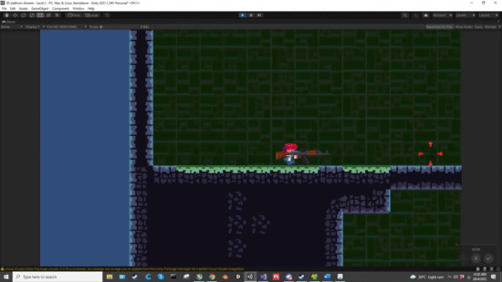
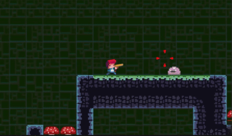

# Simple-2D-platformer-and-shooter

Originally a tutorial project from GameDev.tv Complete C# Unity Game Developer 2D Online Course (2021).  
I wanted to make a 2D shooter so I use the tutorial as a base to build upon. 

Original tutorial includes:
<ol>
  <li> Tilemaps terrain </li>
  <li> Player character </li>
  <li> Enemy </li>
  <li> Basic player movement controls </li>
</ol>

My additions:
<ol>
  <li> Guns </li>
  <li> Bullet Particle FX </li>
  <li> Aiming crosshair </li>
  <li> Death Animations </li>
</ol>

<b> Screenshots: </b>
 

AK-47 goes RATATATAT!!! Enemies explodes, Me Happy!
 

Death animations
 

