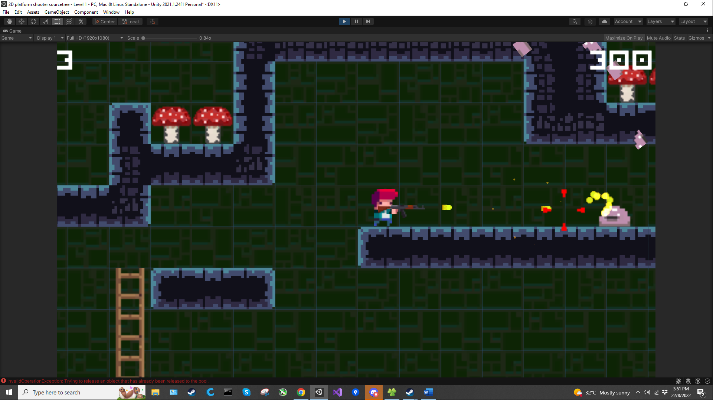

# Simple-2D-platformer-and-shooter

Originally a tutorial project from GameDev.tv Complete C# Unity Game Developer 2D Online Course (2021).
I wanted to make a 2D shooter so I use the tutorial as a base to build upon.

The original tutorial includes:
- Tilemaps terrain 
- Player character 
- Enemy 

My addition:
- Guns
- Bullet Particle FX
- Aiming crosshair
- Death animation

